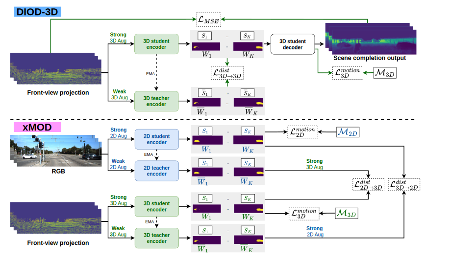

# xMOD: Cross-Modal Distillation for 2D/3D Multi-Object Discovery from 2D motion

This repository contains the official implementation for the paper:

**xMOD: Cross-Modal Distillation for 2D/3D Multi-Object Discovery from 2D motion**
*Saad Lahlali, Sandra Kara, Hejer Ammar, Florian Chabot, Nicolas Granger, Hervé Le Borgne, Quoc-Cuong Pham*
*Proceedings of the Computer Vision and Pattern Recognition Conference (CVPR) 2025*
**[Paper](https://openaccess.thecvf.com/content/CVPR2025/papers/Lahlali_Cross-Modal_Distillation_for_2D3D_Multi-Object_Discovery_from_2D_Motion_CVPR_2025_paper.pdf)**

-----

### 🖼️ Overview

-----

## 📝 Abstract

Object discovery, which refers to the task of localizing objects without human annotations, has gained significant attention in 2D image analysis. However, despite this growing interest, it remains under-explored in 3D data, where approaches rely exclusively on 3D motion, despite its several challenges. In this paper, we present a novel framework that leverages advances in 2D object discovery which are based on 2D motion to exploit the advantages of such motion cues being more flexible and generalizable and to bridge the gap between 2D and 3D modalities. Our primary contributions are twofold: (i) we introduce DIOD-3D, the first baseline for multi-object discovery in 3D data using 2D motion, incorporating scene completion as an auxiliary task to enable dense object localization from sparse input data; (ii) we develop xMOD, a cross-modal training framework that integrates 2D and 3D data while always using 2D motion cues. xMOD employs a teacher-student training paradigm across the two modalities to mitigate confirmation bias by leveraging the domain gap. During inference, the model supports both RGB-only and point cloud-only inputs. Additionally, we propose a late-fusion technique tailored to our pipeline that further enhances performance when both modalities are available at inference. We evaluate our approach extensively on synthetic (TRIP-PD) and challenging real-world datasets (KITTI and Waymo). Notably, our approach yields a substantial performance improvement compared with the 2D object discovery state-of-the-art on all datasets with gains ranging from +8.7 to +15.1 in F1@50 score.

-----

## **✅ Release Checklist**
  - [x] Code for the **PD** dataset.
  - [x] Code for the **KITTI** dataset.
  - [ ] Code for the **nuScenes** dataset (coming soon).

-----

## 🛠️ Installation

Our project is based on the same environment as **[DIOD](https://github.com/CEA-LIST/DIOD)**.

### Requirements

Use the following command to create the Conda environment from the `env.yml` file:

```bash
conda env create -f env.yml
```

-----

## 💾 Datasets

### TRI-PD

  - **Description**: Contains RGB, flow, depth, and various mask annotations.
  - **Download**: You can download the dataset from **[this Google Drive link](https://drive.google.com/drive/folders/1q5AjqhoivJb67h9MZCgUtqb4CooDrZhC?usp=sharing)**.
  - **Structure**:
    ```
    /path/to/TRI_PD_train/
       - scene_000001
          - rgb
             - camera_01
             - ...
          - moving_masks
          - ari_masks
          - est_masks
          - depth
       - scene_000003
       - ...
    ```

### KITTI

  - **Description**: We use the raw RGB sequences for training.
  - **Download**: The dataset can be downloaded from the **[official website](https://www.cvlibs.net/datasets/kitti/)**. The motion segmentations we used can be downloaded from **[here](https://drive.google.com/drive/folders/1q5AjqhoivJb67h9MZCgUtqb4CooDrZhC?usp=sharing)**.
  - **Structure**:
    ```
    /path/to/KITTI_DOM_train/
       - 2011_09_26_drive_0020_sync
          - image_02
             - data/
             - raft_seg/
          - image_03
          - velodyne_points
       - 2011_09_26_drive_0022_sync
       - ...
    ```

-----

## 🚀 Training

The main entry point for all training is `train.py`. The easiest way to run an experiment is to use the provided YAML files in the `configs/` directory.

**Example:**

```bash
python train.py --config configs/kitti_2d_burn_in.yaml
```

You can also override any parameter from the command line.

### KITTI Dataset Commands

#### 1\. 3D Burn-in

Trains a 3D model from scratch.

```bash
python train.py --config configs/kitti_3d_burn_in.yaml
```

#### 2\. 3D Teacher-Student

Fine-tunes a 3D model using distillation. Requires a pre-trained 3D burn-in checkpoint.

```bash
python train.py --config configs/kitti_3d_ts.yaml
```

#### 3\. Cross-Modal (2D+3D) Teacher-Student

Trains both 2D and 3D models with cross-modal distillation. Requires pre-trained 2D and 3D burn-in checkpoints.

```bash
python train.py --config configs/kitti_2d_3d_ts.yaml
```

-----

## 📊 Model Evaluation

To evaluate model performance, use the `eval/evaluate.py` script.

### 2D Model Evaluation (ARI and F1 Score)

```bash
python eval/evaluate.py \
    --evaluation_mode 2d \
    --metrics ari f1 \
    --ckpt_path_2d /path/to/your/2d_model.ckpt
```

### 3D Model Evaluation (ARI and F1 Score)

```bash
python eval/evaluate.py \
    --evaluation_mode 3d \
    --metrics ari f1 \
    --ckpt_path_3d /path/to/your/3d_model.ckpt
```

### Combined (2D+3D) Model Evaluation

Evaluates the merged predictions from both models.

```bash
python eval/evaluate.py \
    --evaluation_mode 2d3d \
    --metrics ari f1 \
    --ckpt_path_2d /path/to/your/2d_model.ckpt \
    --ckpt_path_3d /path/to/your/3d_model.ckpt
```

-----

## 📄 Citation

If you find our work useful in your research, please consider citing our paper:

```bibtex
@inproceedings{lahlali2025cross,
  title={Cross-Modal Distillation for 2D/3D Multi-Object Discovery from 2D Motion},
  author={Lahlali, Saad and Kara, Sandra and Ammar, Hejer and Chabot, Florian and Granger, Nicolas and Le Borgne, Herv{\'e} and Pham, Quoc-Cuong},
  booktitle={Proceedings of the Computer Vision and Pattern Recognition Conference},
  pages={24529--24538},
  year={2025}
}
```

-----

## 🙏 Acknowledgements

This project builds upon the excellent work from the following repository:

  - **DIOD**: [Kara et al., Proceedings of the IEEE/CVF Conference on Computer Vision and Pattern Recognition (CVPR) 2024](https://openaccess.thecvf.com/content/CVPR2024/html/Kara_DIOD_Self-Distillation_Meets_Object_Discovery_CVPR_2024_paper.html)

We thank the authors for making their work publicly available.

-----

## 📜 License

This project is licensed under the [CeCILL version 2.1](http://www.cecill.info/licences.fr.html) license.